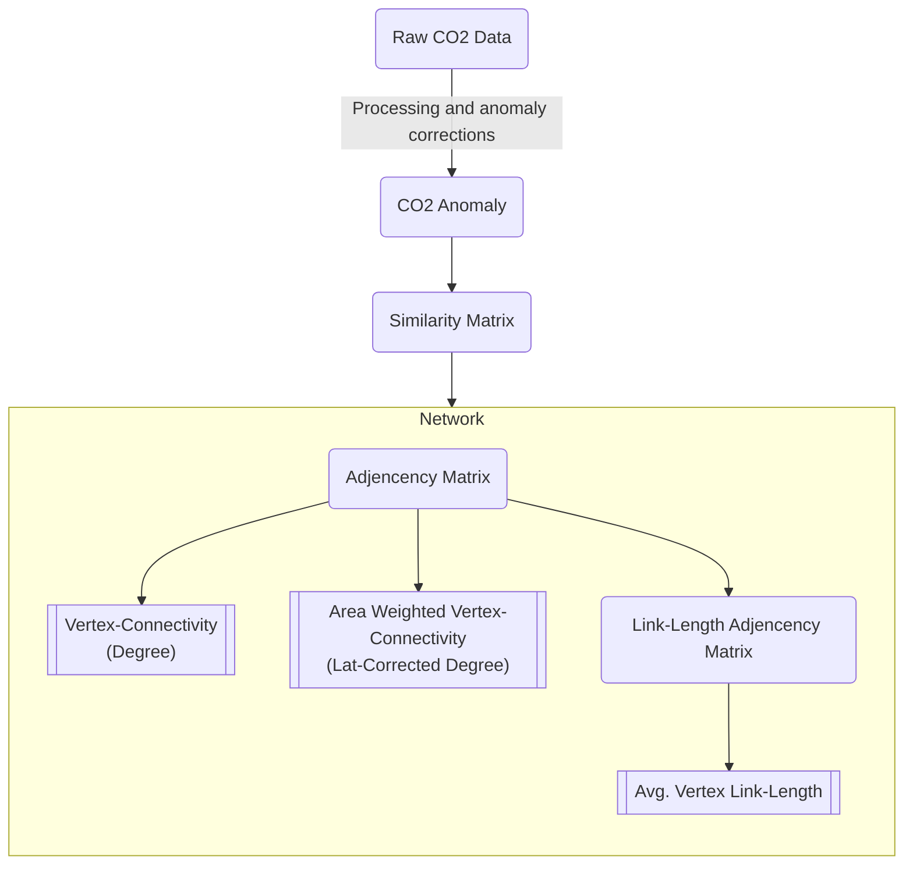

# chaotic-carbon-networks

Create Environment:

```sh
poetry install
```

Use Environment:

```sh
poetry run ...
# like:
poetry run python myfile.py

# or
poetry shell
python myfile.py

```

## Data

Extract the downloaded and compressed data:

> Expects the downloaded data to be in . and extracts the data to ../original/

```sh
cd data/graced/compressed
cat *.tar.gz | tar -xvf - -C ../original -z -i
```

## Data from

[Population (GHSL) from EU](https://ghsl.jrc.ec.europa.eu/download.php?ds=pop)

## Methods and outcomes


