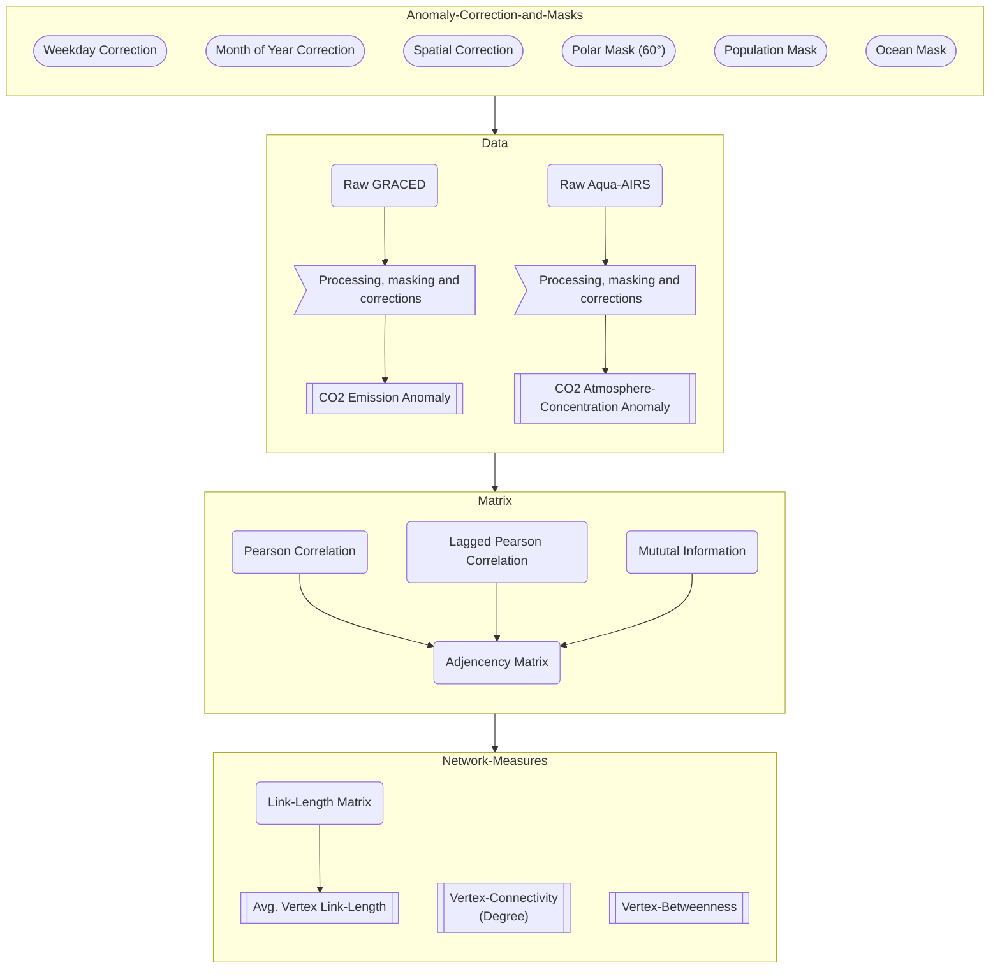

# Chaotic Carbon Networks

Prereq:

- [Rust](https://www.rust-lang.org/tools/install)
- [Pipx](https://pipx.pypa.io/stable/installation/) (for installing maturin)
- [Maturin](https://www.maturin.rs/installation)
- [Poetry](https://python-poetry.org/docs/)

Create Environment:

```sh
poetry install
```

Install RustLibs in dev mode. (Needs to be run after each change in the rust code)

```sh
poetry shell
maturin develop -r
```

Use Environment:

```sh
poetry run ...
# like:
poetry run python myfile.py

# or
poetry shell
python myfile.py

```

## Data

This project uses multiple Data Sources:

- [GRACED](https://www.carbonmonitor-graced.com/datasets.html) for CO2 emissions
- [Aqua AIRS](https://disc.gsfc.nasa.gov/datasets/SNDRAQIL3CMCCP_2/summary) for Atmosphere CO2 concentration
- [Population (GHSL) from EU](https://ghsl.jrc.ec.europa.eu/download.php?ds=pop)
- [Global Ocean Shapes](https://www.naturalearthdata.com/downloads/10m-physical-vectors/10m-ocean/)

```sh
$ tree ./data
 data/
├──  aqua-airs/
│  ├──  raw/
│  ├──  subset_SNDRAQIL3CMCCP_2_20240319_201838_.txt
├──  graced/
│  ├──  cache/
│  ├──  compressed/
│  └──  original/
├──  ocean/
│  ├──  ne_10m_ocean.cpg
│  ├──  ne_10m_ocean.dbf
│  ├──  ne_10m_ocean.prj
│  ├──  ne_10m_ocean.README.html
│  ├──  ne_10m_ocean.shp
│  ├──  ne_10m_ocean.shx
│  └──  ne_10m_ocean.VERSION.txt
└──  population/
   ├──  cache/
   ├──  GHS_POP_E2020_GLOBE_R2023A_4326_30ss_V1_0.tif
   ├──  GHS_POP_E2020_GLOBE_R2023A_4326_30ss_V1_0.tif.ovr
   ├──  GHS_POP_GLOBE_R2023A_input_metadata.xlsx
   └──  GHSL_Data_Package_2
```

## GRACED

Unfortunatly the data download of the GRACED webpage is a little bit bugged... Therefore I manually downloaded the data month-wise and used the following to extract the data to `.nc` files.

Extract the downloaded and compressed data:

> Expects the downloaded data to be in . and extracts the data to ../original/

```sh
cd data/graced/compressed
cat *.tar.gz | tar -xvf - -C ../original -z -i
```

## Aqua AIRS

To download the data please read this website: [Aqua AIRS](https://disc.gsfc.nasa.gov/datasets/SNDRAQIL3CMCCP_2/summary)
I provided a download script `chaotic_carbon_networks.download`. You can read more here.

## Methods and outcomes


