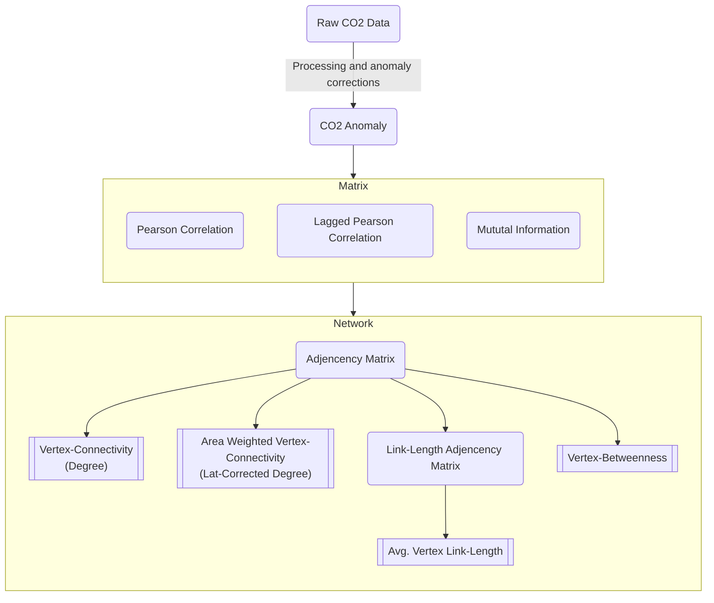

# chaotic-carbon-networks

Prereq:

- [Rust](https://www.rust-lang.org/tools/install)
- [Pipx](https://pipx.pypa.io/stable/installation/) (for installing maturin)
- [Maturin](https://www.maturin.rs/installation)
- [Poetry](https://python-poetry.org/docs/)

Create Environment:

```sh
poetry install
```

Install RustLibs in dev mode. (Needs to be run after each change in the rust code)

```sh
maturin develop -r
```

Use Environment:

```sh
poetry run ...
# like:
poetry run python myfile.py

# or
poetry shell
python myfile.py

```

## Data

Extract the downloaded and compressed data:

> Expects the downloaded data to be in . and extracts the data to ../original/

```sh
cd data/graced/compressed
cat *.tar.gz | tar -xvf - -C ../original -z -i
```

## Data from

[Population (GHSL) from EU](https://ghsl.jrc.ec.europa.eu/download.php?ds=pop)

Expected Directory

```sh
tree data
 data/
├──  aqua-airs/
│  ├──  download.py
│  ├──  How_to_Access_GES_DISC_Data_Using_Python.ipynb
│  ├──  raw/
│  ├──  subset_SNDRAQIL3CMCCP_2_20240319_201838_.txt
├──  graced/
│  ├──  cache/
│  ├──  compressed/
│  └──  original/
├──  ocean/
│  ├──  ne_10m_ocean.cpg
│  ├──  ne_10m_ocean.dbf
│  ├──  ne_10m_ocean.prj
│  ├──  ne_10m_ocean.README.html
│  ├──  ne_10m_ocean.shp
│  ├──  ne_10m_ocean.shx
│  └──  ne_10m_ocean.VERSION.txt
├──  population/
│  ├──  cache/
│  ├──  GHS_POP_E2020_GLOBE_R2023A_4326_30ss_V1_0.tif
│  ├──  GHS_POP_E2020_GLOBE_R2023A_4326_30ss_V1_0.tif.ovr
│  ├──  GHS_POP_GLOBE_R2023A_input_metadata.xlsx
│  └──  GHSL_Data_Package_2023.pdf
└──  xco2_c3s_l3_v42_200301_201912_2x2.nc
```

## Methods and outcomes


